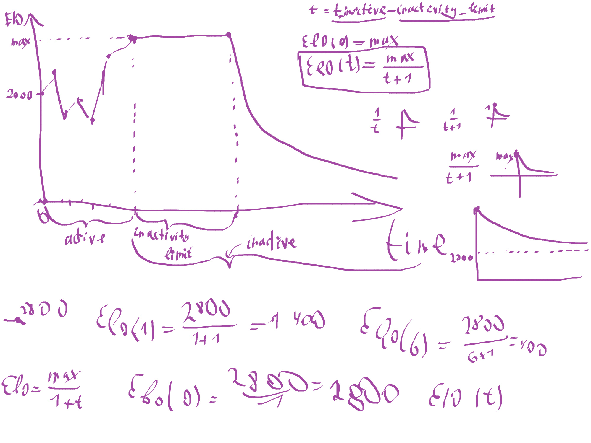

# First C/C++ Projects
This repository consists of a set of my really old Visual Studio projects. Mostly written in **C/C++**.

These projects are quite messy and most of the time are one of my very first programming attempts.  
However, there is one or two worth taking a look at:
- [Upsell Elo System](#upsell-elo-system) that implements a *Git-like VCS*
- [Survey engine](#survey-engine) (unfinished but implements some cool bit-level compression)

---
## Upsell Elo System
[This project](UpsellElo/UpsellElo) was my first one to be published and get used.  
A friend of mine asked whether I could create an Elo-like ranking system for the league that he was running.  
I have never tried to make one so I immediately took on the challenge.  

The code itself is pretty awful: I have had no idea of any algorithms or data structures, most of the branching and logic is done with `for` loops solely. The idea of an algorithmic complexity was not known to me at that point as well.  

But what makes it interesting is the fact that at some point we realised someone might make a mistake in input data. Or one might think of roll the whole ranking back to some point in the past.  

For this reason I have come up and have implemented my own simple \*Git-like\* (I have had no idea of what Git is at that point, neither of any other VCS) Version Control System which could:
- store all the inputs and changes ever commited to the ranking
- keep them in an incredibly efficient compact form
- allow for a roll-back to any previous stage in history
- export or import the whole *chronicle* file
- check for entry name conflicts and resolve those

This project features a [successfull attempt](UpsellElo/UpsellElo/archive) to save and document the source code of the application itself as well.

The system had also exposed an interesting Elo-decay mechanism binded with the *chronicle* roll-back.  

Elo decay model illustration

Moreover, the system was highly customisable and the user was provided with the text file with a whole lot of settings he could have changed in case he was willing to.  

The code was horrible, it was slow. But it did its job and served well for over 2 years of the league.

---
## Survey Engine
[This project](TheSurvey/TheSurvey) could easily be my own very first C++ project.  
It wasn't even finished.  

It's quite fascinating to look at it in terms of what I have learned since, and comparing it to my recent projects. 

Some of the intriguing parts of this simple survey engine include the compression and serialisation algorithms that I have implemented in order to minimise the size of the responses (which were expected to be mailed by the respondents).  

Even though it's totally useless (as our bandwidth is measured in hundreds of megabytes instead of single bytes today) the very compressing part is ingenious as for a fresh student's first project.